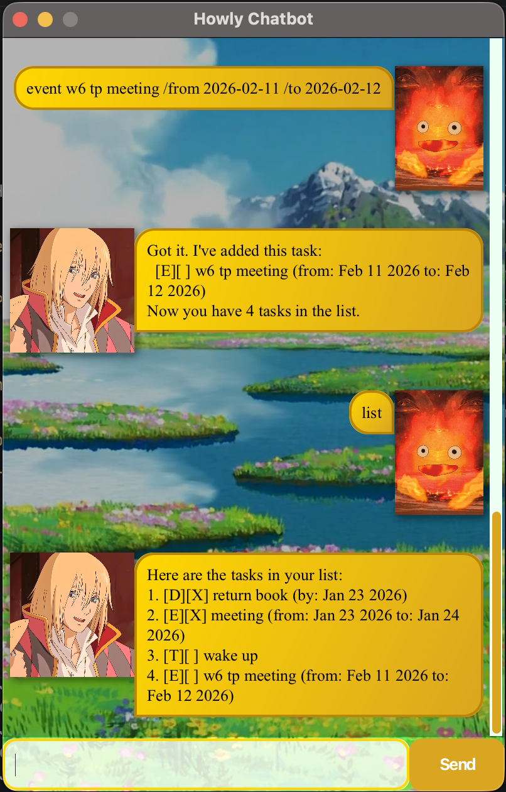

# Howly User Guide 🔮

Howly is a **local memory-retaining, desktop chatbot app for managing tasks, optimized for use via a Graphic User Interface (GUI)**. Howly helps you keep track of your daily to-dos, deadlines and events, themed upon Howl's Moving Castle.

* [Quick Start](https://haleycopter.github.io/ip/#quick-start-)
* [Features](https://haleycopter.github.io/ip/#features-)
    * [Adding a ToDo: `todo`](https://haleycopter.github.io/ip/#adding-a-todo-todo)
    * [Adding a Deadline: `deadline`](https://haleycopter.github.io/ip/#adding-a-deadline-deadline)
    * [Adding an Event: `event`](https://haleycopter.github.io/ip/#adding-an-event-event)
    * [Marking / Unmarking a task: `mark` or `unmark`](https://haleycopter.github.io/ip/#marking--unmarking-a-task-mark-or-unmark)
    * [Updating a Task: `update`](https://haleycopter.github.io/ip/#updating-a-task-update)
    * [Finding a Task with a specific description: `find`](https://haleycopter.github.io/ip/#finding-a-task-with-a-specific-description-find)
    * [Finding a Task with a specific date: `finddate`](https://haleycopter.github.io/ip/#finding-a-task-with-a-specific-date-finddate)
  * [Adding a ToDo: `todo`](https://haleycopter.github.io/ip/#adding-a-todo-todo)
  * [Adding a Deadline: `deadline`](https://haleycopter.github.io/ip/#adding-a-deadline-deadline)
  * [Adding an Event: `event`](https://haleycopter.github.io/ip/#adding-an-event-event)
  * [Marking / Unmarking a task: `mark` or `unmark`](https://haleycopter.github.io/ip/#marking--unmarking-a-task-mark-or-unmark)
  * [Updating a Task: `update`](https://haleycopter.github.io/ip/#updating-a-task-update)
  * [Finding a Task with a specific description: `find`](https://haleycopter.github.io/ip/#finding-a-task-with-a-specific-description-find)
  * [Finding a Task with a specific date: `finddate`](https://haleycopter.github.io/ip/#finding-a-task-with-a-specific-date-finddate)
  * [Exiting the app: `bye`](https://haleycopter.github.io/ip/#exiting-the-app-bye)
* [Command Summary](https://haleycopter.github.io/ip/#command-summary-)
* [FAQ](https://haleycopter.github.io/ip/#faq)

## Quick Start 💻
1. Ensure you have Java `17` or above installed in your Computer.\
   Mac users: Ensure you are using an exact Azul JDK version prescribed [here](https://se-education.org/guides/tutorials/javaInstallationMac.html).
2. Download the latest `.jar` file from [here](https://github.com/Haleycopter/ip/releases/download/v0.2/howly.jar).
3. Open a command terminal, `cd` into the folder you put the jar file in, and use the `java -jar howly.jar` command to run the application.\
   A GUI similar to the below should appear in a few seconds. Note that you'll be greeted by Howly with no tasks stored yet.

   

4. Type the command in the command box and press Enter or click `Send` to execute it.
5. Some example commands you can try:
   * `todo meet friend` : Adds a task named `meet friend` to the task list.
   * `list` : Lists all tasks.
   * `mark 1`: marks the task with index 1 with an `X`.
   * `delete 1`: deletes the task with index 1 and updates task list.
6. Refer to the [Features](https://haleycopter.github.io/ip/#features-) section below for details of each command.

## Features 📒

> [!IMPORTANT]
> **Notes about the command format:**
> * Words in `UPPER_CASE` are the parameters to be supplied by the user.
>   * e.g. in `todo DESCRIPTION`, `DESCRIPTION` is a parameter which can be used as `todo eat meal`.
> * Parameters **cannot** be in any order.
>   * e.g. if the command specifies `deadline DESCRIPTION /by YYYY-MM-DD`, `deadline /by YYYY-MM-DD DESCRIPTION` is **NOT** accepted.

### Adding a ToDo: `todo`
Adds a task with a task name.\
Format: `todo DESCRIPTION`\
Example: `todo meet friend`\
Outcome: Adds the todo to your task list. Run `list` to check!

### Adding a Deadline: `deadline`
Adds a task with a specific deadline date.\
Format: `deadline DESCRIPTION /by YYYY-MM-DD`\
Example: `deadline return book /by 2026-12-01`\
Outcome: Adds the deadline to your task list.

### Adding an Event: `event`
Adds a task that occurs during a specific time period.\
Format: `event DESCRIPTION /from YYYY-MM-DD /to YYYY-MM-DD`\
Example: `event project meeting /from 2026-02-11 /to 2026-02-12`\
Outcome: Adds the event to your task list.

### Marking / Unmarking a task: `mark` or `unmark`
Marks or unmarks the task specified by the index.\
Format: `mark INDEX`\
Example: `mark 1`\
Outcome: Adds or removes an `X` in the checkbox of the specified task.

### Updating a Task: `update`
Updates the description of an existing task.\
Format: `update INDEX NEW_DESCRIPTION`\
Example: `update 1 buy more flowers`\
Outcome: Changes the description of the first task.

### Finding a Task with a specific description: `find`
Finds and lists all tasks with the description specified after the `find` command.\
Format: `find DESCRIPTION`\
Example: `find friend`\
Outcome: Lists out all tasks with matching description specified.

### Finding a Task with a specific date: `finddate`
Finds and lists all tasks with the date specified after the `finddate` command.\
Format: `finddate YYYY-MM-DD`\
Example: `find 2026-01-11`\
Outcome: Lists out all tasks with matching date specified.

### Exiting the app: `bye`
Displays a bye message and closes the app within a second.\
Format: `bye`\
Example: `bye`\
Outcome: Task list is automatically stored for next user session and app closes.

## Command Summary ⏩

| Action | Format, Examples |
| :--- | :--- |
| **Add Todo** | `todo DESCRIPTION`   e.g. `todo buy bread` |
| **Add Deadline** | `deadline DESCRIPTION /by YYYY-MM-DD`   e.g. `deadline return book /by 2026-12-01` |
| **Add Event** | `event DESCRIPTION /from YYYY-MM-DD /to YYYY-MM-DD`   e.g. `event project meeting /from 2026-02-11 /to 2026-02-12` |
| **Mark/Unmark Event** | `mark INDEX` or `unmark INDEX`   e.g. `mark 1` or `unmark 1`|
| **Update** | `update INDEX NEW_DESCRIPTION`   e.g. `update 1 read chapter 2` |
| **Delete** | `delete INDEX`   e.g. `delete 3` |
| **Find** | `find DESCRIPTION`   e.g. `find book` |
| **Find Date** | `finddate DATE`   e.g. `finddate 2026-01-11` |
| **List** | `list` |
| **Exit** | `bye` |

## FAQ

**Q**: Is my data still saved if I run the chatbot on another local device?\
**A**: No, data from your current local device is not shared with another device, nor will this data be automatically populated in the storage of the chatbot when you run on another local device. Ensure you copy current content in `/data/howly.txt` and paste it in the same text file location in your other local device.

**Q**: Where is the `howly.txt` file located?\
**A**: The file is automatically created in a folder named `data` within the same directory where you placed the `ip.jar` file.

**Q**: What Java version do I need to run Howly?\
**A**: Ensure you are using an exact Azul JDK version prescribed [here](https://se-education.org/guides/tutorials/javaInstallationMac.html). You can check your version by typing `java -version` in your terminal.

**Q**: What happens if I accidentally edit the `howly.txt` file and the app crashes?\
**A**: Howly will attempt to load the file, but if the format is invalid, it may start with an empty list. It is recommended to back up your `howly.txt`(have the content stored somewhere) before manual editing.
